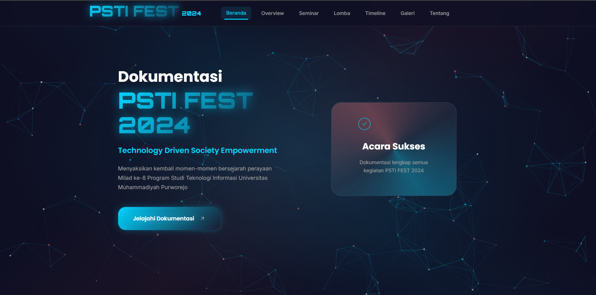

# 🚀 PSTI FEST 2024 - Website Dokumentasi Resmi

<div align="center">
  
  
  
</div>

## 🌟 Tentang Proyek

Website dokumentasi resmi untuk acara tahunan Program Studi Teknologi Informasi dengan tema **"Technology Driven Society Empowerment"**. Dibangun dengan teknologi modern dan desain futuristik untuk memberikan pengalaman pengguna yang optimal.

## ✨ Fitur Unggulan

### 🔐 Sistem Autentikasi
- **Login/Register** dengan validasi form
- **Manajemen Session** yang aman
- **Profil Pengguna** dengan avatar
- **Role-based Access Control** (Admin/User)

### 🖥️ Dashboard Admin
- **CRUD** (Buat, Baca, Update, Hapus) konten
- **Manajemen Pengguna**
- **Analitik Pengunjung**
- **Backup Database**

### 🎨 Fitur Interaktif
- **Dark/Light Mode**
- **Responsive Design** (Mobile, Tablet, Desktop)
- **Animasi Modern** dengan GSAP
- **Gallery dengan Lightbox**
- **Form dengan Validasi**
- **Pencarian & Filter**

## 🛠️ Teknologi

### Frontend
- **HTML5** (Semantic Markup)
- **CSS3** (Flexbox, Grid, Animations)
- **JavaScript** (ES6+)
- **Particles.js** (Background Effects)

### Backend
- **Node.js**
- **Express.js**
- **MongoDB** (Database)
- **JWT** (Autentikasi)

## 🚀 Cara Instalasi

### Prasyarat
- Node.js (v14+)
- npm (v6+)
- MongoDB

### Langkah-langkah
1. Clone repository
   ```bash
   git clone https://github.com/username/psti-fest-2024.git
   cd psti-fest-2024
   ```

2. Install dependencies
   ```bash
   npm install
   ```

3. Konfigurasi Environment
   ```bash
   cp .env.example .env
   # Sesuaikan konfigurasi di file .env
   ```

4. Jalankan Aplikasi
   ```bash
   npm start
   ```

5. Buka di Browser
   ```
   http://localhost:3000
   ```

## 📂 Struktur Proyek

```
psti-fest-2024/
├── public/           # File statis (images, fonts, etc.)
├── src/
│   ├── assets/       # Aset (CSS, JS, images)
│   ├── components/   # Komponen UI
│   ├── config/       # Konfigurasi
│   ├── controllers/  # Logic controller
│   ├── middleware/   # Middleware Express
│   ├── models/       # Model database
│   ├── routes/       # Route definitions
│   └── views/        # Template views
├── .env.example      # Contoh konfigurasi
├── app.js            # Aplikasi utama
└── package.json      # Dependensi dan scripts
```

## 📸 Screenshot



### Cara Menambahkan Screenshot:
1. Simpan screenshot dengan nama `home.png` di folder `screenshots/`
2. Gambar akan otomatis muncul di atas
3. Pastikan ukuran gambar maksimal 1200px lebar untuk tampilan optimal

## 🤝 Berkontribusi

Kontribusi terbuka! Ikuti langkah berikut:
1. Fork repository
2. Buat branch (`git checkout -b fitur/namafitur`)
3. Commit perubahan (`git commit -m 'Menambahkan fitur baru'`)
4. Push ke branch (`git push origin fitur/namafitur`)
5. Buat Pull Request

## 📄 Lisensi

Dilisensikan di bawah [MIT License](LICENSE)

---

## 👨‍💻 Developer

👤 **hey.alk**  
💼 [Portofolio](https://github.com/hey-alk) | ✉️ [Email](mailto:hey.alk@example.com)

© 2024 PSTI FEST - All Rights Reserved

## Struktur File

```
psti-fest-docs/
├── index.html              # File HTML utama
├── css/
│   ├── style.css           # CSS utama dengan design system
│   ├── navbar.css          # Styling navigation
│   ├── hero.css            # Styling hero section
│   ├── sections.css        # Styling semua sections
│   └── gallery.css         # Styling gallery dan lightbox
├── js/
│   ├── main.js             # JavaScript utama
│   ├── gallery.js          # Fungsi gallery dan lightbox
│   └── animations.js       # Animasi dan efek visual
├── images/
│   ├── seminar/            # Foto-foto seminar
│   ├── lomba/              # Foto-foto lomba
│   └── galeri/             # Foto-foto galeri umum
└── assets/
    ├── icons/              # Icon files
    └── fonts/              # Font files
```

## Konten Website

### Statistik Acara
- **500+ Peserta**: Total peserta semua kegiatan
- **3 Kompetisi**: Ideathon, Badminton, Smart Village Awards
- **4 Hari Acara**: Durasi pelaksanaan PSTI FEST 2024
- **1 Seminar**: Seminar Nasional AI dan Smart Village

### Timeline Kegiatan
1. **18 Jun 2024**: Pembukaan Pendaftaran
2. **22 Jul 2024**: Seminar Nasional
3. **24 Jul 2024**: Lomba Ideathon
4. **26 Jul 2024**: Lomba Badminton
5. **29 Jul 2024**: Acara Puncak

### Kompetisi
1. **Ideathon**: 50+ tim, hadiah Rp 2.25M
2. **Badminton**: 32 peserta, hadiah Rp 650K
3. **Smart Village Awards**: 15 desa, penghargaan plakat

## Cara Deployment

### 1. Static Hosting
Website dapat di-deploy ke platform static hosting seperti:
- Vercel
- Netlify
- GitHub Pages
- Firebase Hosting

### 2. Web Server
Dapat dijalankan di web server dengan:
- Apache
- Nginx
- Python HTTP Server

### 3. Langkah Deployment
1. Upload semua file ke hosting
2. Pastikan struktur folder tetap sama
3. Set index.html sebagai file utama
4. Konfigurasi domain (jika diperlukan)

## Optimasi yang Telah Dilakukan

### 1. Performance
- Lazy loading untuk gambar
- Optimized CSS dengan custom properties
- Efficient JavaScript dengan debouncing
- Compressed images

### 2. SEO
- Semantic HTML markup
- Meta tags yang sesuai
- Alt text untuk gambar
- Structured data

### 3. Accessibility
- Keyboard navigation support
- Screen reader friendly
- High contrast colors
- Focus indicators

### 4. Mobile Optimization
- Responsive design
- Touch-friendly navigation
- Optimized images untuk mobile
- Fast loading times

## Browser Support
- Chrome 80+
- Firefox 75+
- Safari 13+
- Edge 80+

## Customization

### Mengganti Warna
Edit variabel CSS di `css/style.css`:
```css
:root {
    --primary-color: #1a1a2e;
    --secondary-color: #00d4ff;
    --accent-color: #ff6b6b;
}
```

### Menambah Konten
1. Edit `index.html` untuk menambah section
2. Tambah styling di file CSS yang sesuai
3. Tambah JavaScript jika diperlukan interaktivitas

### Mengganti Gambar
1. Upload gambar baru ke folder `images/`
2. Update path di HTML
3. Pastikan ukuran dan format sesuai

## Maintenance
- Update konten secara berkala
- Backup file secara rutin
- Monitor performance website
- Update dependencies jika diperlukan

## Contact
Untuk pertanyaan atau support, hubungi:
- Program Studi Teknologi Informasi
- Universitas Muhammadiyah Purworejo
- Email: psti@ump.ac.id

---

Website ini dibuat dengan ❤️ untuk mendokumentasikan PSTI FEST 2024

